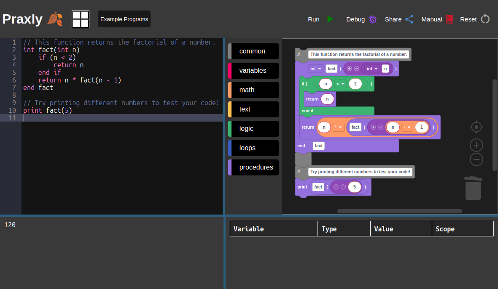
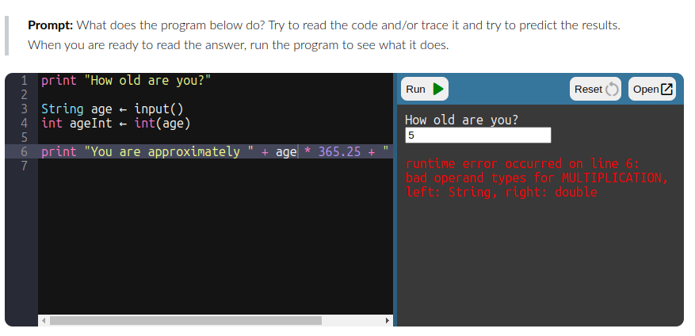

# Praxly

Praxly is a web-based IDE that empowers users to read, write, and run the [pseudocode][1] used in the [CS Praxis Test][2].
Praxly supports bidirectional synchronization between both block-based and text-based editors, allowing users to learn and visualize the code while also offering the efficiency of editing text.
The text editor uses [Ace][3], and the block editor uses [Blockly][4].

[1]: https://www.ets.org/pdfs/praxis/5652.pdf#page=21
[2]: https://praxis.ets.org/test/5652.html
[3]: https://ace.c9.io/
[4]: https://developers.google.com/blockly

_Screenshot of Praxly running a recursive factorial function_


## Development

Install dependencies:
```
$ npm install
```

To run locally:
```
$ npm run dev
```

## Unit Testing

Install dependencies:
```
$ pip install colorama selenium
```

To run locally:
```
$ cd test
$ ./run_all.sh
```

_Note: This script connects to the local dev server._

## Deployment

To build (manually) for production:
```
PRAXLY_PATH=/relative/path/on/server npm run build
```

_Note: Deployment to praxly.cs.jmu.edu is automated via GitHub actions._

## Embedding

You can embed Praxly on any website using an iframe:

```html
<iframe width="100%" height="600"
    src="https://praxly.cs.jmu.edu/embed.html?button=both#code=print%201%0Aprint%202%0Aprint%203">
</iframe>
```

The `embed.html` page takes the following parameters:

Parameter | Options               | Description             |
----------|-----------------------|-------------------------|
&editor=  | text*, blocks, both   | Which editor(s) to show |
&button=  | run*, debug, both     | Which button(s) to show |
&result=  | output*, vars, both   | Which result(s) to show |
\#code=   | url-encoded format    | The initial source code |

\* = default values for embedded mode

_Screenshot of Praxly embedded in an iframe on Canvas LMS_


## License

Praxly's source code is available under [CC BY-NC-SA](https://creativecommons.org/licenses/by-nc-sa/4.0/).
